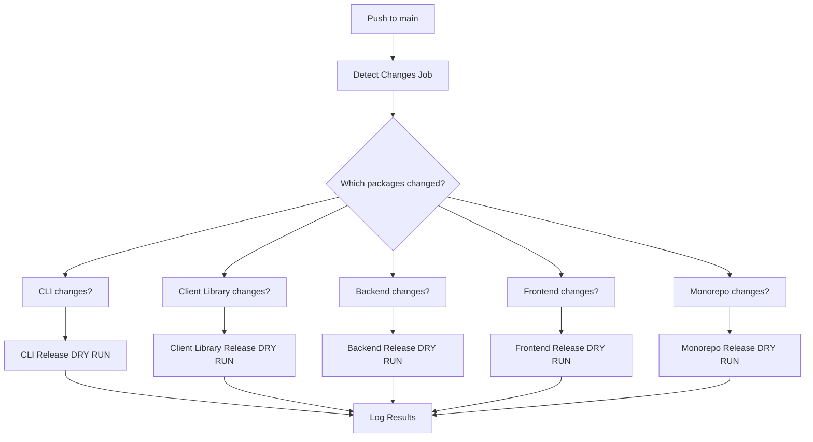

# Automated Package Change Detection & Release System

## 🎯 Overview

The SSApp Registry monorepo now features an **automated package change detection system** that intelligently determines which packages need new versions based on actual code changes, not just commit message patterns.

## 🚀 How It Works

### 1. **Smart Change Detection**

The system analyzes git changes to determine which packages were actually modified:

- **Package-specific changes**: Detects changes in `packages/cli/`, `packages/client-library/`, `packages/backend/`, `packages/frontend/`
- **Monorepo-wide changes**: Detects root-level changes that affect all packages
- **Tag-based comparison**: Compares against the last release tag for each package
- **Fallback handling**: Uses initial commit when no tags exist yet

### 2. **Intelligent Release Type Detection**

Automatically determines release type based on commit messages:

- `fix(*)` → **Patch** release (bug fixes)
- `feat(*)` → **Minor** release (new features)
- `BREAKING CHANGE` or `!:` → **Major** release (breaking changes)

### 3. **Selective Release Triggers**

Only packages with actual changes get released:

- ✅ **CLI changes** → CLI package release
- ✅ **Client Library changes** → Client Library release
- ✅ **Backend changes** → Backend release
- ✅ **Frontend changes** → Frontend release
- ✅ **Monorepo changes** → Coordinated release of all packages

## 🛠️ Implementation

### Core Components

#### 1. **Change Detection Script** (`scripts/detect-changes.sh`)

```bash
# Analyze changes since last release
./scripts/detect-changes.sh

# Analyze specific commit range
./scripts/detect-changes.sh HEAD~1..HEAD

# Analyze since specific tag
./scripts/detect-changes.sh cli-v1.0.0..HEAD
```

#### 2. **GitHub Actions Workflow** (`.github/workflows/semantic-release.yml`)

- **Two-stage process**: Detection → Release
- **Conditional execution**: Only runs release steps for changed packages
- **Dry-run mode**: Safe testing without actual releases

#### 3. **Package Configuration**

Each package has its own semantic release configuration:

- `packages/cli/.releaserc.json`
- `packages/client-library/.releaserc.json`
- Package-specific tag formats (`cli-v*`, `lib-v*`)

## 📊 Detection Logic

### Package Change Detection

```bash
# CLI package changes
git diff --name-only $CLI_LAST_TAG..HEAD | grep -q "^packages/cli/"

# Client Library changes
git diff --name-only $LIB_LAST_TAG..HEAD | grep -q "^packages/client-library/"

# Backend changes
git diff --name-only $BACKEND_LAST_TAG..HEAD | grep -q "^packages/backend/"

# Frontend changes
git diff --name-only $FRONTEND_LAST_TAG..HEAD | grep -q "^packages/frontend/"
```

### Monorepo Change Detection

```bash
# Root-level changes (excluding common files)
git diff --name-only $CLI_LAST_TAG..HEAD | \
  grep -v "^packages/" | \
  grep -v "^\.github/" | \
  grep -v "^\.gitignore" | \
  grep -v "^pnpm-lock.yaml" | \
  grep -v "^README.md" | \
  grep -v "^VERSIONING.md" | \
  grep -v "^COMMIT_CONVENTIONS.md"
```

## 🧪 Testing the System

### Local Testing

```bash
# Test change detection
./scripts/detect-changes.sh

# Test specific commit range
./scripts/detect-changes.sh HEAD~1..HEAD

# Test with specific tags
./scripts/detect-changes.sh cli-v0.1.0..HEAD
```

### CI Testing

1. **Push a commit** with changes to a specific package
2. **Monitor GitHub Actions** at: `https://github.com/calimero-network/app-registry/actions`
3. **Check the logs** for detection output and dry-run results

### Example Test Scenarios

#### Test CLI Changes

```bash
# Make a change to CLI package
echo "# Test" > packages/cli/src/test.md
git add packages/cli/src/test.md
git commit -m "feat(cli): add new feature"
git push origin main
```

**Expected Output:**

```
✅ CLI package has changes
🎯 Release type: minor
📊 Change Summary:
  CLI: true
  LIB: false
  Backend: false
  Frontend: false
  Monorepo: false
```

#### Test Monorepo Changes

```bash
# Make a root-level change
echo "# Test" > root-test.md
git add root-test.md
git commit -m "fix: update root configuration"
git push origin main
```

**Expected Output:**

```
✅ Monorepo-wide changes detected
🎯 Release type: patch
📊 Change Summary:
  CLI: false
  LIB: false
  Backend: false
  Frontend: false
  Monorepo: true
```

## 🔧 Configuration

### Environment Variables

- `GITHUB_TOKEN`: GitHub API access
- `NPM_TOKEN`: npm publishing (for CLI and Client Library)

### Workflow Triggers

- **Push to main**: Triggers detection and release
- **Manual trigger**: Available for testing via `workflow_dispatch`

### Dry-Run Mode

All releases are currently in dry-run mode for safe testing:

- ✅ **Detection works**: Shows which packages would be released
- ✅ **No actual releases**: No tags, npm publishes, or GitHub releases
- ✅ **Safe testing**: Can test without consequences

## 🚀 Enabling Real Releases

To enable actual releases, uncomment the semantic-release commands in `.github/workflows/semantic-release.yml`:

```yaml
# CLI Package Release
- name: Release CLI Package
  if: needs.detect-changes.outputs.cli-changed == 'true'
  run: |
    cd packages/cli
    npx semantic-release  # Uncomment this line
```

## 📈 Benefits

### 1. **Accurate Release Detection**

- ✅ Only releases packages that actually changed
- ✅ Prevents unnecessary version bumps
- ✅ Maintains package independence

### 2. **Intelligent Versioning**

- ✅ Automatic release type detection
- ✅ Semantic versioning compliance
- ✅ Breaking change detection

### 3. **Safe and Testable**

- ✅ Dry-run mode for testing
- ✅ Comprehensive logging
- ✅ Conditional execution

### 4. **Monorepo Optimized**

- ✅ Package-specific tags
- ✅ Independent versioning
- ✅ Coordinated releases when needed

## 🔍 Monitoring

### GitHub Actions Dashboard

- **Workflow**: `Semantic Release`
- **Jobs**: `detect-changes` → `semantic-release`
- **Logs**: Detailed detection and release information

### Key Metrics

- **Detection accuracy**: Which packages were detected as changed
- **Release type**: Patch, minor, or major
- **Execution time**: Performance monitoring
- **Success rate**: Release success/failure tracking

## 🛡️ Safety Features

### 1. **Dry-Run Protection**

- All releases are dry-run by default
- No accidental publishes or tags
- Safe testing environment

### 2. **Conditional Execution**

- Only runs for changed packages
- Prevents unnecessary work
- Reduces CI/CD costs

### 3. **Comprehensive Logging**

- Detailed change detection output
- Clear release type identification
- Full audit trail

### 4. **Error Handling**

- Graceful fallbacks for missing tags
- Robust git command handling
- Clear error messages

## 🔄 Workflow Summary



This automated system ensures that **only packages with actual changes get new versions**, making the release process more accurate, efficient, and reliable. 🎯
