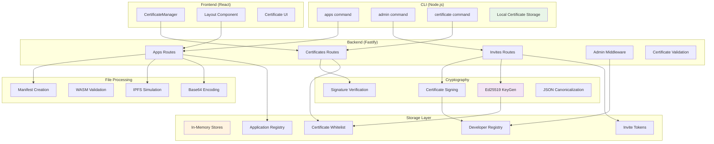

# Developer Workflow Documentation

## Overview

This document describes the complete certificate-based developer workflow for the SSApp Registry, from admin invitation to application publishing.

## Architecture

The system uses Ed25519 cryptographic certificates for developer authentication and authorization. The workflow consists of three main phases:

1. **Admin Invitation** - Admin creates invite links for new developers
2. **Developer Onboarding** - Developers redeem invites to get certificates
3. **Application Publishing** - Developers use CLI to publish WASM applications

### Technical Architecture



## Phase 1: Admin Invitation

### Admin Commands

```bash
# Create an invite for a new developer
node packages/cli/dist/index.js admin create-invite \
  --display-name "John Doe" \
  --website "https://johndoe.dev" \
  --email "john@example.com"
```

### What Happens

1. Admin generates a unique invite token
2. Token is stored in registry with developer metadata
3. Invite link is returned: `http://localhost:3000/redeem-invite/{token}`
4. Admin shares this link with the developer

### Backend API

- **Endpoint**: `POST /admin/invites/create`
- **Authentication**: Admin-level access required
- **Response**: Invite token and redemption link

## Phase 2: Developer Onboarding

### Developer Process

1. Developer receives invite link from admin
2. Developer visits the link in browser or uses CLI
3. Certificate is automatically generated and downloaded

### CLI Command

```bash
# Redeem invite using token
node packages/cli/dist/index.js certificate redeem --token {invite-token}
```

### What Happens

1. Backend generates Ed25519 keypair for developer
2. Certificate is created with developer metadata
3. Certificate is cryptographically signed by registry
4. Developer public key is added to whitelist
5. Certificate and private key are returned to developer
6. CLI stores certificate locally in `~/.ssapp-registry/`

### Backend API

- **Endpoint**: `GET /invites/{token}/redeem`
- **Authentication**: Valid invite token
- **Response**: Signed certificate and private key

### Certificate Structure

```json
{
  "certificate_id": "cert-1756812980176-56tm40fqg",
  "developer_pubkey": "ed25519:A/u+v6tmkonis8y+42fSrl8kEl5xbUFRGiezpp9ZRdM=",
  "developer_private_key": "ed25519:...",
  "display_name": "John Doe",
  "website": "https://johndoe.dev",
  "email": "john@example.com",
  "permissions": ["upload"],
  "valid_from": "2025-01-22T...",
  "expires_at": "2026-01-22T...",
  "signature": "...",
  "issued_by": "SSApp Registry"
}
```

## Phase 3: Application Publishing

### CLI Command

```bash
# Publish a WASM application
node packages/cli/dist/index.js apps publish \
  --wasm demo-app.wasm \
  --name "My Awesome App" \
  --description "A demo application" \
  --app-version "1.0.0" \
  --author "John Doe" \
  --license "MIT" \
  --chains "calimero"
```

### What Happens

#### 1. Certificate Validation

- CLI loads local certificate from `~/.ssapp-registry/`
- CLI validates certificate with registry via `GET /certificates/{pubkey}`
- Registry confirms developer is still whitelisted

#### 2. File Processing

- CLI reads WASM file from local filesystem
- WASM binary is encoded as base64 string
- JSON payload is created with metadata + base64 content

#### 3. Upload Request

- **Method**: HTTP POST to `/apps/upload`
- **Headers**:
  - `Content-Type: application/json`
  - `X-Developer-Pubkey: {developer_public_key}` (for authentication)
  - `X-Developer-Certificate: {certificate_id}` (for logging)
- **Body**: JSON with app metadata and base64 WASM content

#### 4. Backend Processing

- Validates developer public key from header
- Checks whitelist authorization
- Decodes base64 back to binary WASM
- Simulates IPFS upload (generates CID)
- Creates application manifest
- Stores in registry

#### 5. Response

- Returns success message with IPFS CID
- CLI displays publication summary

### Backend API

- **Endpoint**: `POST /apps/upload`
- **Authentication**: X-Developer-Pubkey header + whitelist validation
- **Body**: JSON with `wasm_content` (base64) and metadata

### Upload Payload Structure

```json
{
  "name": "My Awesome App",
  "version": "1.0.0",
  "description": "A demo application",
  "author": "John Doe",
  "license": "MIT",
  "chains": "calimero",
  "wasm_content": "AGFzbQEAAAABBAFgAAF/AhgB..." // base64 encoded WASM
}
```

## Security Features

### Authentication

- **Header-based**: Developer public key sent in `X-Developer-Pubkey` header
- **Separation of concerns**: Authentication data separate from business data
- **No URL logging**: Credentials not exposed in URL parameters

### Authorization

- **Whitelist-based**: Only invited developers can publish
- **Certificate validation**: Each request validates certificate is still valid
- **Cryptographic signatures**: Ed25519 signatures ensure certificate integrity

### File Upload

- **Base64 encoding**: Reliable for small WASM files
- **Size validation**: File size limits enforced
- **Content validation**: WASM format validation (future enhancement)

## File Locations

### CLI Certificate Storage

```
~/.ssapp-registry/
├── certificate.json          # Developer certificate
├── config.json              # CLI configuration
└── logs/                     # Operation logs
```

### Backend Storage

```
In-memory stores (production would use database):
├── certificates/             # Certificate storage
├── developers/               # Developer metadata
├── apps/                     # Published applications
├── manifests/                # Application manifests
└── invites/                  # Active invite tokens
```

## Example Success Flow

### 1. Admin Creates Invite

```bash
$ node packages/cli/dist/index.js admin create-invite --display-name "Alice Developer"
✅ Invite created successfully!
📋 Invite Details:
   Token: inv_1756816123456_abc123
   Link: http://localhost:3000/redeem-invite/inv_1756816123456_abc123
   Expires: 2025-01-29T...
```

### 2. Developer Redeems Invite

```bash
$ node packages/cli/dist/index.js certificate redeem --token inv_1756816123456_abc123
✅ Certificate installed successfully!
📜 Certificate Details:
   ID: cert-1756816234567-def456
   Developer: Alice Developer
   Public Key: ed25519:xyz...
   Valid Until: 2026-01-22T...
```

### 3. Developer Publishes App

```bash
$ node packages/cli/dist/index.js apps publish --wasm my-app.wasm --name "Alice App" --app-version "1.0.0"
✅ Application published successfully!
📦 Publishing App:
   Name: Alice App
   Version: 1.0.0
   Size: 2.3KB
   Certificate: cert-1756816234567-def456
   Author: Alice Developer

✅ Publication Summary:
   📱 App: Alice App@1.0.0
   🔐 Certificate: cert-1756816234567-def456
   📦 WASM Size: 2.3KB
   🌐 Chains: calimero
   📄 License: MIT
   ☁️ IPFS CID: QmDemo1756816345678hij789
```

## Error Handling

### Common Errors

1. **Certificate Not Found**

   ```
   ❌ Error: No certificate found. Please redeem an invite first.
   ```

2. **Developer Not Whitelisted**

   ```
   ❌ Error: Developer not authorized to upload applications
   Details: Certificate not found in whitelist
   ```

3. **Invalid File**

   ```
   ❌ Error: WASM file not found: demo-app.wasm
   ```

4. **Network Error**
   ```
   ❌ Error: Registry not available at http://localhost:8080
   ```

## Technical Implementation

### Cryptography

- **Algorithm**: Ed25519 (secure, fast)
- **Library**: `tweetnacl` (well-tested, CommonJS compatible)
- **Encoding**: Base64 for public keys, JSON canonicalization for signatures

### HTTP Client

- **CLI**: `axios` (reliable multipart handling)
- **Backend**: `@fastify/multipart` (for future file uploads)
- **Upload Method**: Base64 JSON (current), multipart support available

### Validation

- **Schema**: Fastify JSON Schema validation
- **Certificate**: Ed25519 signature verification
- **Whitelist**: Real-time authorization checks

## Future Enhancements

1. **Database Storage**: Replace in-memory stores with persistent database
2. **Real IPFS**: Replace simulated IPFS with actual IPFS integration
3. **Certificate Rotation**: Support for certificate renewal/rotation
4. **Role-based Access**: Multiple permission levels beyond basic whitelist
5. **File Validation**: WASM format validation and security scanning
6. **Audit Logging**: Comprehensive audit trail for all operations
7. **Web Interface**: Frontend for certificate and app management

## API Reference

### Admin Endpoints

- `POST /admin/invites/create` - Create developer invite
- `GET /admin/invites` - List active invites
- `DELETE /admin/invites/{token}` - Revoke invite

### Developer Endpoints

- `GET /invites/{token}/redeem` - Redeem invite for certificate
- `GET /certificates/{pubkey}` - Validate certificate
- `POST /apps/upload` - Upload application

### Public Endpoints

- `GET /apps` - List published applications
- `GET /apps/{name}` - Get application details
- `GET /healthz` - Service health check

This workflow provides a secure, user-friendly process for onboarding developers and publishing applications to the SSApp Registry.
